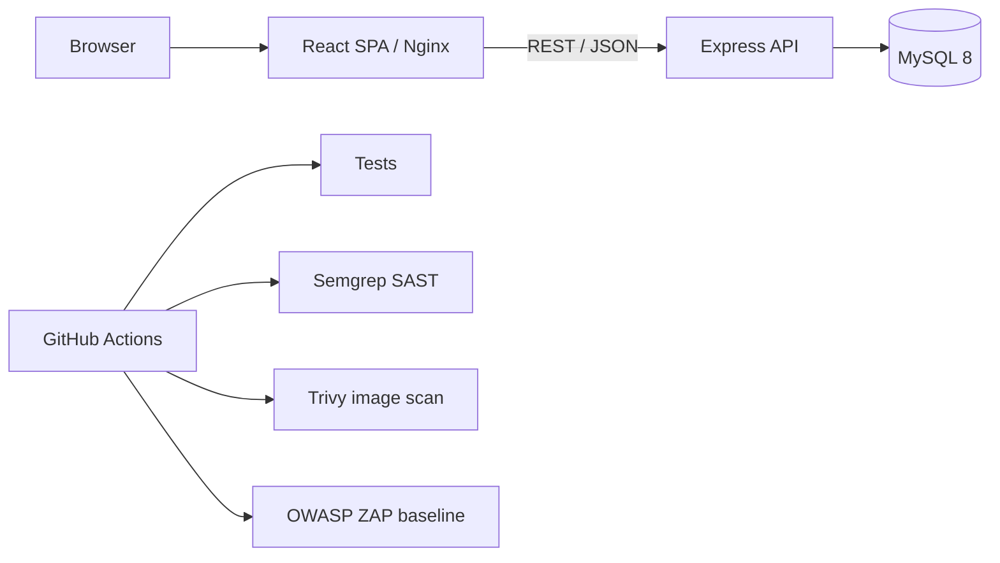

<div align="center">

# RubyGYM

**Gym customer management and promotion system**

[](https://github.com/vuvannam-sec/rubygym/actions/workflows/project2-security-ci.yml)


Project 12 — Công nghệ phần mềm · Project 2 — An toàn ứng dụng web & CI/CD security

</div>

RubyGYM là ứng dụng web phục vụ một trung tâm thể hình giả lập, tập trung vào hai mục tiêu học thuật: xây dựng phần mềm theo quy trình có truy vết và triển khai các kiểm soát AppSec trong CI/CD. Repo được giữ ở phạm vi classroom MVP; các chức năng thanh toán, email/SMS và tích hợp thiết bị không nằm trong phạm vi hiện tại.

## Course alignment

| Học phần | Trọng tâm | Bằng chứng trong repo |
| --- | --- | --- |
| **Project 12 — Công nghệ phần mềm** | Yêu cầu, thiết kế, lập trình, kiểm thử, tài liệu | `docs/software-engineering-plan.md`, UML/ERD trong `docs/diagrams/`, backend tests, Docker Compose |
| **Project 2 — An toàn ứng dụng web** | SAST, DAST, container scanning, threat modeling | `.github/workflows/project2-security-ci.yml`, Semgrep, Trivy, OWASP ZAP, `docs/stride-threat-model.md` |

Chi tiết mapping giữa yêu cầu, code và test nằm tại [`docs/requirements-traceability.md`](docs/requirements-traceability.md).

## Chức năng chính

- Quản lý tài khoản và phân quyền `ADMIN`, `TRAINER`, `MEMBER`.
- Quản lý huấn luyện viên, hội viên và quan hệ phân công.
- Lập lịch tập với giới hạn giờ mở cửa, thời lượng buổi, tải làm việc của HLV và số hội viên/buổi.
- Hội viên tự đặt mục tiêu tập luyện; HLV sử dụng mục tiêu đó khi đánh giá tiến độ.
- Đánh giá theo tháng dựa trên cân nặng, BMI và mục tiêu cá nhân.
- Gói hội viên 3/6/12 tháng, loyalty bonus và referral bonus.
- Trang công khai cho chương trình, HLV, sự kiện và đăng ký.

## Kiến trúc



| Layer | Technology |
| --- | --- |
| Frontend | React 19, React Router, Axios, CSS design tokens |
| Backend | Node.js, Express 5, JWT, bcrypt |
| Database | MySQL 8 |
| Runtime | Docker, Docker Compose, Nginx |
| Security CI | GitHub Actions, Semgrep, Trivy, OWASP ZAP |

## Quick start

Yêu cầu: Docker Engine/Desktop có hỗ trợ Docker Compose.

```bash
git clone https://github.com/vuvannam-sec/rubygym.git
cd rubygym
cp .env.example .env
docker compose up -d --build
```

| Service | URL |
| --- | --- |
| Frontend | http://localhost:8080 |
| Backend API | http://localhost:3000/api |
| Health check | http://localhost:3000/api/health |
| MySQL | localhost:3306 |

Dừng stack:

```bash
docker compose down
# Xóa luôn volume/data của môi trường local nếu cần:
docker compose down -v
```

> `.env.example` chỉ chứa giá trị mẫu cho môi trường local. Không dùng các giá trị này cho deployment thật.

### Demo accounts

| Role | Email | Password |
| --- | --- | --- |
| Admin | `admin@rubygym.com` | `admin123` |
| Trainer | `trainer.linh@rubygym.com` | `trainer123` |
| Member | `member.an@rubygym.com` | `member123` |

Các tài khoản trên được tạo từ `docker/seed.sql` và chỉ dùng cho demo/classroom environment.

## Local development

```bash
# Backend — cần MySQL chạy sẵn và biến môi trường phù hợp
cd backend
npm install
npm run dev

# Frontend
cd frontend
npm install
npm start
```

## Testing

```bash
cd backend && npm test
cd frontend && CI=true npm test -- --watchAll=false
```

Security workflow còn chạy Docker build, Semgrep, Trivy và ZAP trên GitHub Actions.

## Security lab design

`backend/src/routes/vulnerable-demo.js` là **fixture cố ý chứa lỗi** để chứng minh SAST có thể phát hiện SQL injection, XSS, hardcoded credential pattern, path traversal, insecure random và `eval`. File này không được mount vào Express application runtime; workflow quét riêng ở job non-blocking, trong khi application code thật vẫn chịu SAST gate.

Xem thêm [`SECURITY.md`](SECURITY.md) và [`docs/stride-threat-model.md`](docs/stride-threat-model.md).

## Repository layout

```text
rubygym/
├── .github/
│   └── workflows/              # CI/CD + security scanning
├── backend/
│   ├── src/                    # Express API, middleware, routes
│   └── tests/                  # Jest + Supertest
├── frontend/                   # React SPA
├── docker/                     # schema + seed data
├── docs/
│   ├── diagrams/               # PlantUML sources + rendered diagrams
│   ├── architecture-decisions.md
│   ├── requirements-traceability.md
│   ├── software-engineering-plan.md
│   └── stride-threat-model.md
├── .env.example
├── docker-compose.yml
└── README.md
```

## Documentation

Bắt đầu từ [`docs/README.md`](docs/README.md) để xem index tài liệu. Các JSON/HTML report tạo bởi Semgrep, Trivy và ZAP được lưu dưới dạng GitHub Actions artifacts thay vì commit vào repository.

## Scope notes

Đây là đồ án học thuật, không phải hệ thống production. Payment gateway, notification delivery, biometric/device integration và attendance hardware được cố ý loại khỏi MVP. Các quyết định kiến trúc chính được ghi tại [`docs/architecture-decisions.md`](docs/architecture-decisions.md).
